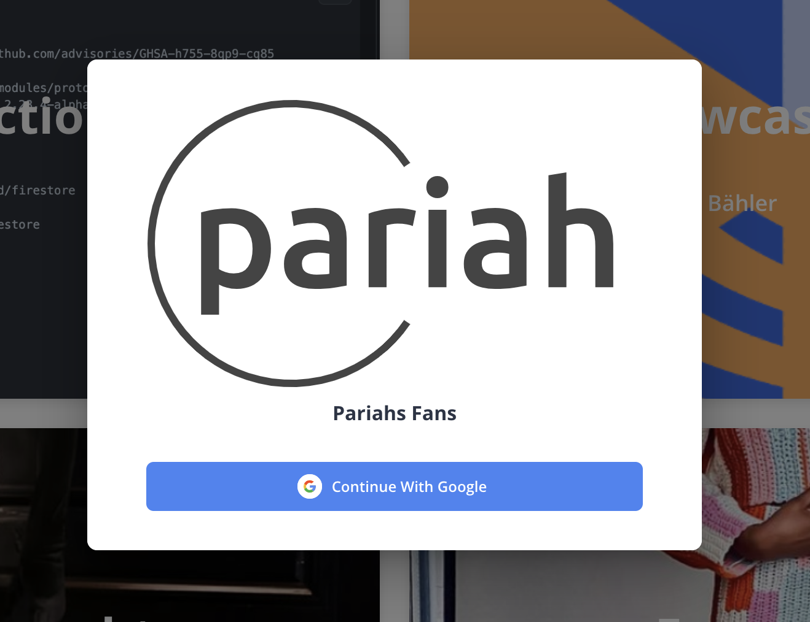

# User Documentation

This documentation outlines the interactions with Pariah for users. See

- [User Documentation](#user-documentation)
  - [Overview](#overview)
  - [Login](#login)
  - [Dashboard](#dashboard)
    - [Liked Items](#liked-items)
    - [Account](#account)
    - [Collections](#collections)
      - [Collections Overview](#collections-overview)
      - [Create Collection](#create-collection)
      - [Edit Collection](#edit-collection)
      - [Delete Collection](#delete-collection)
      - [Detail-View Collections](#detail-view-collections)
    - [Products](#products)
      - [Create Product](#create-product)
      - [Edit Product](#edit-product)
      - [Delete Product](#delete-product)
      - [Detail-View Product](#detail-view-product)
    - [Components](#components)
      - [QR-Code Editor](#qr-code-editor)
      - [Web-Editor](#web-editor)

## Overview

When accessing Pariah, you see the newest Collections and Items that have been added to the platform. Something like this:

## Login

To get your own account on Pariah, you need to login. You can do this by clicking on the `Login` button in the top right corner:

Currently only Login via Google is possible. Therefor it's a requirement to have a Google account:

## Dashboard

Via the dashboard you can manage the items you liked. You can create new collections and items, edit and delete them. You can also change your profile settings. To access the dashboard, you need to be [logged in](#login). Once logged in you can access the dashboard via the button in the top right corner:

### Liked Items

Once you are accessing the dashboard you are directly taken to the overview of your liked items. Here you can see all the items you liked. You can also remove them from your liked items. For your first login, you won't yet have any items there:

### Account

You can change your profile settings in the profile section. You must navigate to `Account Settings` on the dashboard. You can change your name. You can add a biographie for your user-account which is displayed on your profile.

### Collections

To interact with collections you have an entire navigation-section called `Collections`. Here you can see all the collections you have created. You can also create new collections, edit and delete them.

#### Collections Overview

In the overview of your collections you can see all collections you have created so far.

In the overview you can further interact with the collections. You can edit and delete them. You can also see all the items that are part of the collection.

Here's the actions you can take on the collections:

* [Detail-View](#detail-view-collections)
* [Create Collection](#create-collection)
* [Edit Collection](#edit-collection)
* [Delete Collection](#delete-collection)
* See Like-Count
* Publish/Unpublish Collection
* Generate [QR-Code](#qr-code-editor)

#### Create Collection

When you click `Create` in the Collection navigation, you are taken to the create collection page. Here you can add a title, description and a cover image to the collection. You can also add items to the collection. **You must add at least one image for the collection**. You can shift the order of the images by dragging them around. The first image in order is the icon displayed for the collection. To add the story to the collection, you can use the [Web-Editor](#web-editor).

To save the collection, you need to click the `Save` button. The Creation was successful once you are brought to the [Edit Collection](#edit-collection) page.

#### Edit Collection

The Edit view offers the same functionality as the [Create Collection](#create-collection) view. You can change the title, description and cover image of the collection. You can also add and remove items from the collection. You can also change the order of the items. To save the changes you need to click the `Save` button.

#### Delete Collection

When a collection is deleted everything associated with the collection is deleted as well (images etc.).

#### Detail-View Collections

The detail-view shows the collection in the front-end. You can see the title, description and the cover image of the collection. You can also see all the items that are part of the collection. You can also see the story of the collection. This is how other users see your collection.

### Products

To interact with products you have an entire navigation-section called `Products`. Here you can see all the products you have created. You can also create new products, edit and delete them.

* [Detail-View](#detail-view-products)
* [Create Product](#create-product)
* [Edit Product](#edit-product)
* [Delete Product](#delete-product)
* See Like-Count
* Publish/Unpublish Product
* Generate [QR-Code](#qr-code-editor)

#### Create Product

When you click `Create` in the Products navigation, you are taken to the create product page. Here you can add a title, description and a cover image to the product. **You must define a collection this product belongs to, therefor you must create a collection first**. **You must add at least one image for the product**. You can shift the order of the images by dragging them around. The first image in order is the icon displayed for the product. To add the story to the product, you can use the [Web-Editor](#web-editor).

To save the collection, you need to click the `Save` button. The Creation was successful once you are brought to the [Edit Collection](#edit-collection) page.

#### Edit Product

The Edit view offers the same functionality as the [Create Product](#create-product) view. You can change the title, description and cover image of the product. You can also add and remove items from the product. You can also change the order of the items. To save the changes you need to click the `Save` button.

#### Delete Product

When a product is deleted everything associated with the product is deleted as well (images etc.).

#### Detail-View Product

The detail-view shows the product in the front-end. You can see the title, description and the cover image of the product. You can also see all the items that are part of the collection. You can also see the story of the product. This is how other users see your product.

### Components

These components are available to the user for different interactions. 

#### QR-Code Editor

With the QR-Editor you can style the QR-Code to your liking. You can change the color of the QR-Code and the background. You can also add a logo to the QR-Code.

You need to click the `save` button to save the changes to the QR-Code (If you want to persist the changes). You can also download the QR-Code as a PNG file.

#### Web-Editor

The Web-Editor allows you to create content for the web. You can add text to the web-editor. You can also style the content with different fonts and colors.

